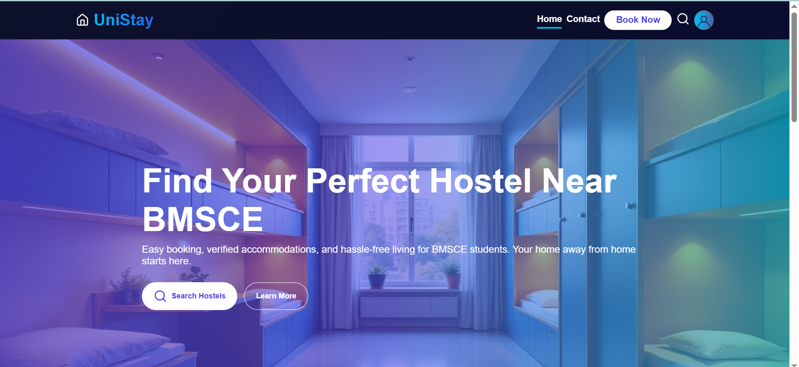
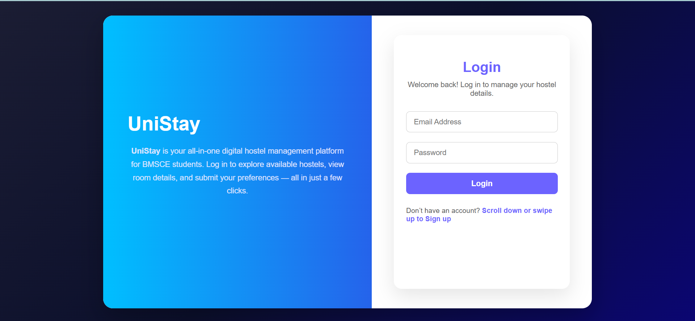
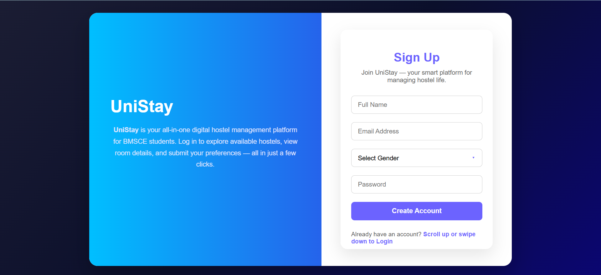
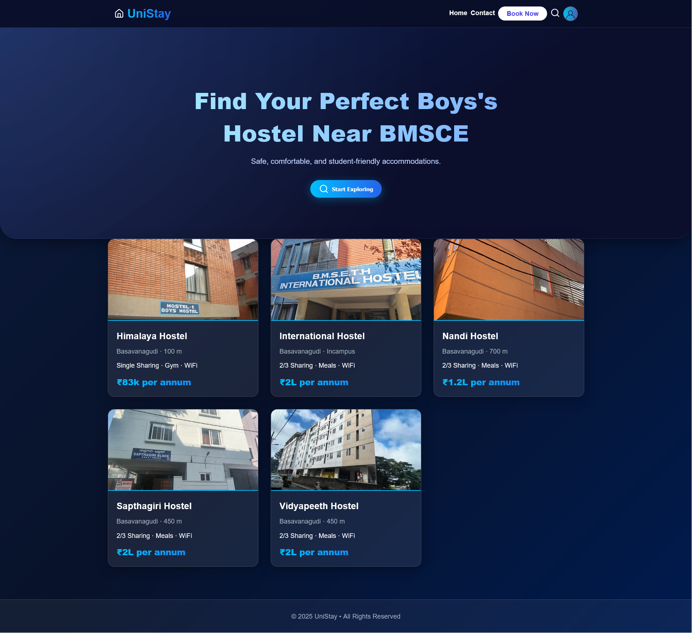
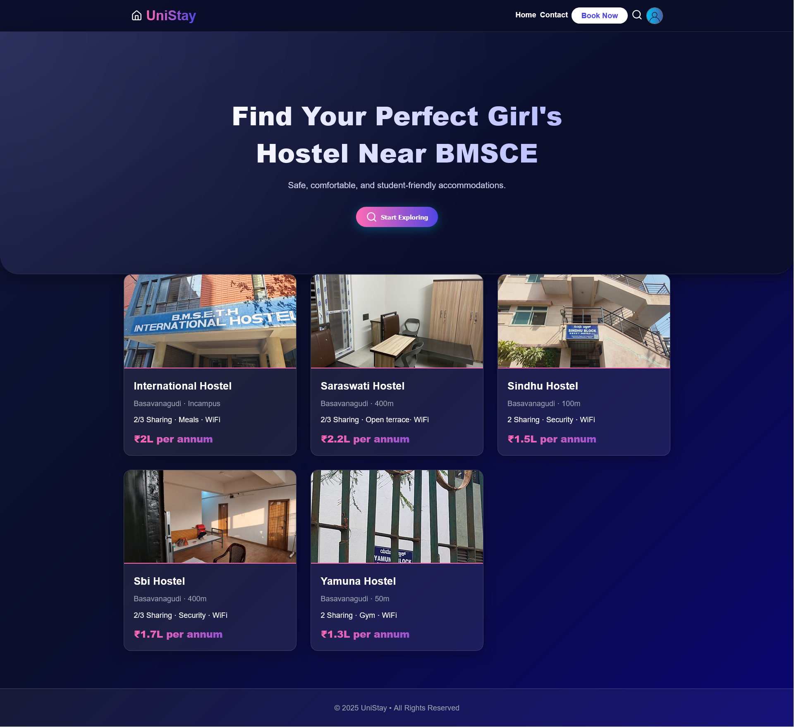
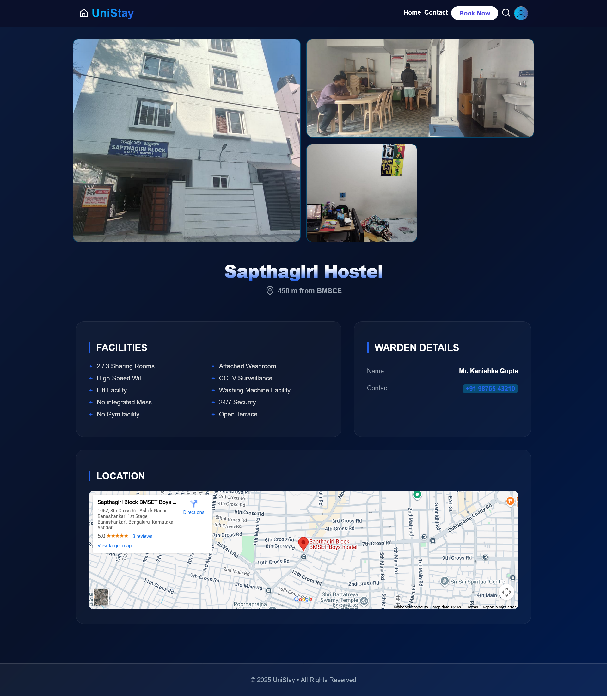
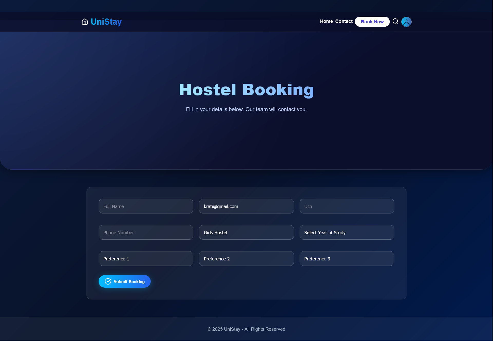
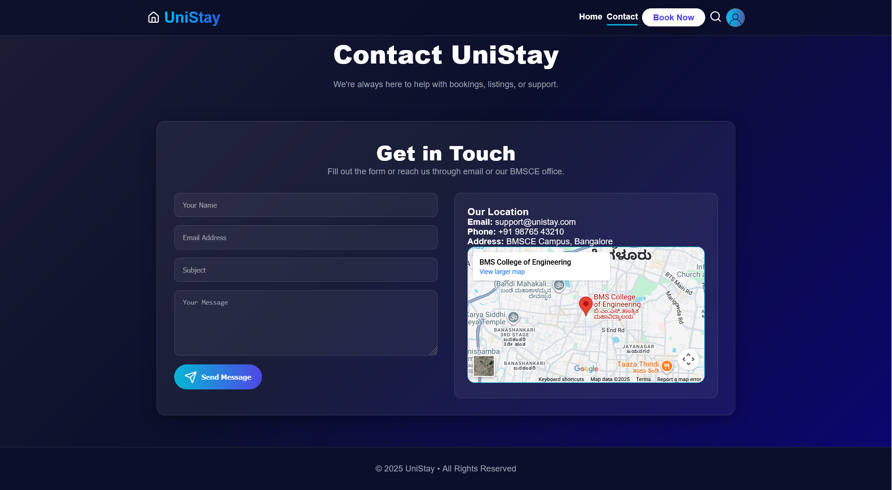
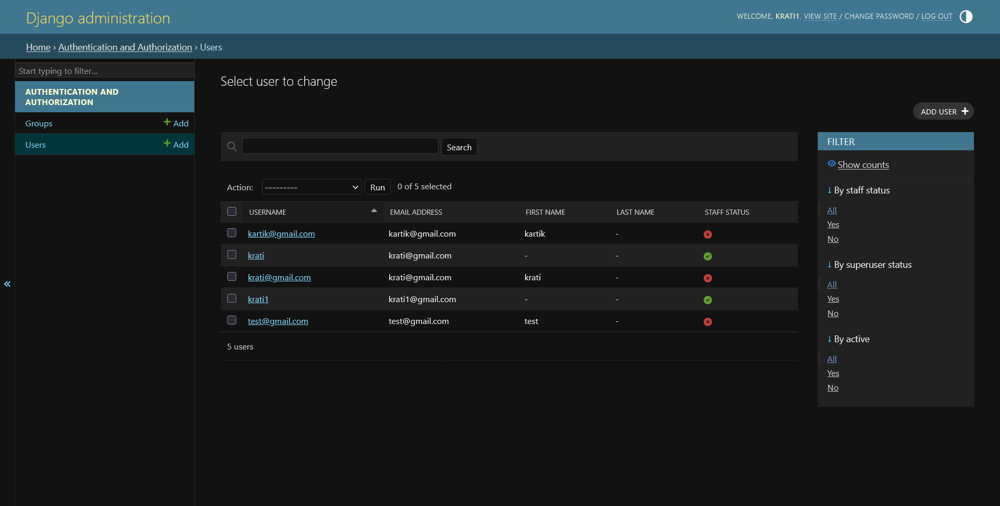

# UniStay – Hostel Booking & Management System

## Full Stack Web Development Project

## Project Description
- UniStay is a web-based hostel booking and management system
- Developed for students of B.M.S. College of Engineering (BMSCE)
- Built as part of the Full Stack Web Development (FWD) course
- Provides a centralized platform for hostel information and booking

## Project Information
- **Project Title**: UniStay
- **Course**: Full Stack Web Development (23CS3AEFWD)
- **Semester**: 3
- **Degree**: B.E. Computer Science and Engineering
- **Institution**: B.M.S. College of Engineering, Bengaluru
- **University**: Visvesvaraya Technological University (VTU)
- **Academic Year**: Sep 2025 – Jan 2026

## Team Members
- Krati Goel (1BF24CS148)
- Krishna Lath (1BF24CS149)
- Kritarth Teli (1BF24CS150)
- Kritika Panwar (1BF24CS151)

## Project Guide
- Mrs. Rachana M S
- Assistant Professor, Department of CSE, BMSCE

## Features
- User registration and login
- Secure authentication and authorization
- Gender-based hostel filtering
- Hostel listing and detail pages
- Online hostel booking system
- Booking confirmation and restriction of multiple bookings
- Contact page for queries
- Admin management using Django Admin Panel

## Technologies Used

### Frontend
- HTML
- CSS
- JavaScript
- Django Templates

### Backend
- Python
- Django Framework (MVT Architecture)

### Database
- MySQL

### Tools
- Visual Studio Code
- Django Development Server
- Google Maps API

## System Requirements

### Hardware Requirements
- Processor: Intel Core i3 or higher
- RAM: 8 GB or higher
- Storage: Minimum 500 GB HDD / SSD
- Stable internet connection
- Display resolution: 1366 × 768 or higher

### Software Requirements
- Operating System: Windows
- Programming Language: Python
- Web Framework: Django
- Database: MySQL
- Web Browser: Google Chrome 
- IDE: Visual Studio Code

## Project Architecture
- Django Model–View–Template (MVT) architecture
- Models define database schema
- Views handle business logic
- Templates render dynamic content
- Django ORM for database operations
- Secure authentication and CSRF protection

## Backend Flow
- User action sends HTTP request from frontend
- Django URL routing maps request
- View processes request
- Authentication and authorization verified
- Input validation performed
- Business logic applied
- Django ORM interacts with MySQL database
- Response rendered using templates
- Admin operations handled via Django Admin Panel

## User Interface Screenshots

### Login Page

### Signup Page

### Boys Hostel Listing Page

### Girls Hostel Listing Page

### Girls Hostel Detail Page

### Boys Hostel Detail Page

### Booking Page

### Booking Confirmation Page

### Contact Page

### Admin Panel

## Conclusion
- UniStay provides a secure and user-friendly hostel booking platform
- Reduces manual effort and improves transparency
- Successfully integrates frontend, backend, and database
- Meets all academic objectives of the FWD course

## Future Enhancements
- Admin approval and rejection of bookings
- Online payment integration
- Email and SMS notifications
- Room availability tracking
- Search and filter functionality
- Mobile application version
- Support for multiple institutions

## References
- https://www.djangoproject.com/
- https://docs.djangoproject.com/
- https://developer.mozilla.org/
- https://stackoverflow.com/
- https://www.mysql.com/
- https://dev.mysql.com/doc/
- https://www.w3schools.com/
- https://code.visualstudio.com/
- https://developers.google.com/maps

